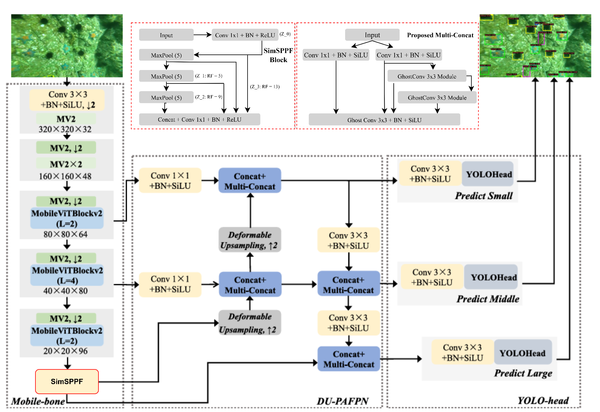

# Marine Organism Detection — GhostConv + SimSPPF


**Project author and maintainer:** [Wilbert Andrew Yonathan (WAYTECHG)](https://github.com/WAYTECHG)  
**Institution:** Xiamen University Malaysia  
**Academic context:** AIT304 — Advanced Issues of Artificial Intelligence (Computer Vision)

This repository presents my adaptation of DU-MobileYOLO, the model comparisons and ablation experiments carried out for this project, and a linked interactive demonstration. My contribution focuses on integrating and evaluating GhostConv and SimSPPF within the existing detector. The underlying DU-MobileYOLO architecture and the original Ghost and SimSPPF concepts are credited to their respective authors.

## Project Title

**Integration of GhostConv and SimSPPF into a Deformable-Upsampling Lightweight Detector for Marine Organism Detection**

This project implements and evaluates a lightweight object detector for marine organism detection on the URPC2020 dataset. The work is based on the DU-MobileYOLO framework and focuses on reducing computational redundancy while preserving the deformable upsampling mechanism.

The final proposed model is:

```text
DU-MobileYOLO + GhostConv + SimSPPF
```

The `GhostConv + SPPF` configuration is included only as an ablation variant, not as the final proposed method.

---

## Live Demo

Try the interactive marine detection demo:

[🚀 Open Live Demo](https://huggingface.co/spaces/Wizzas/Marine-Object-Detection)

## My Contributions

| Area | Contribution in this project |
| --- | --- |
| Model adaptation | Integrated GhostConv into selected 3×3 convolution layers in the Multi-Concat blocks and replaced the original pooling structure with SimSPPF. |
| Preserved architecture | Retained the existing Deformable Upsampling mechanism rather than claiming it as a new component developed for this project. |
| Baseline comparisons | Retrained and evaluated DU-MobileYOLO and YOLOv7-tiny for comparison on the project's URPC2020 split. |
| Ablation study | Evaluated GhostConv, SPPF, SimSPPF, and their selected combinations to examine the effects of individual modifications. |
| Evaluation | Compared detection accuracy, precision, recall, parameter count, GFLOPs, and measured latency; documented both improvements and trade-offs. |
| Experiment workflow | Organized variant-specific configurations, an experiment runner, supporting scripts, and documented training, testing, and detection commands. |
| Interactive demonstration | Prepared and deployed a marine detection demo on Hugging Face Spaces for visitors to explore the project's detection workflow. |

The final proposed configuration is **DU-MobileYOLO + GhostConv + SimSPPF**. The contribution is the adaptation, integration, and experimental evaluation of established components in this detector; this project does not claim to have invented DU-MobileYOLO, Ghost modules, or SimSPPF.

## Upstream Work and Acknowledgements

This project builds on the following work:

- **[DU-MobileYOLO](https://github.com/ZERO-SPACE-X/DU-MobileYOLO):** the base marine organism detector and its Deformable Upsampling mechanism. The upstream repository is distributed under GPL-3.0.
- **[YOLOv7](https://github.com/WongKinYiu/yolov7):** the detector implementation ecosystem and the YOLOv7-tiny comparison model.
- **[GhostNet: More Features From Cheap Operations](https://openaccess.thecvf.com/content_CVPR_2020/html/Han_GhostNet_More_Features_From_Cheap_Operations_CVPR_2020_paper.html), Han et al., CVPR 2020:** the original Ghost module concept used as the basis for GhostConv.
- **[YOLOv6 SimSPPF implementation](https://github.com/meituan/YOLOv6/blob/main/yolov6/layers/common.py):** a reference for simplified spatial pyramid pooling with ReLU activation.
- **URPC2020:** the underwater object detection dataset used for the project. The distribution used in these experiments is linked in the Dataset section.

Credit for these upstream architectures, concepts, code, and dataset remains with their original authors. My project-specific changes and evaluation are described in the contribution table above.

---

## Main Idea

The proposed model modifies selected computationally redundant parts of DU-MobileYOLO:

1. **SimSPPF** replaces the original parallel spatial pyramid pooling structure with a simplified SPPF-style sequential pooling module using ReLU activation.
2. **GhostConv** replaces selected standard 3×3 convolution layers inside Multi-Concat blocks to reduce parameter cost.
3. **Deformable Upsampling (DU)** is kept unchanged to preserve spatial alignment during feature fusion.

---


## Proposed Architecture

The final proposed detector integrates **GhostConv into the Multi-Concat blocks** and **SimSPPF into the pooling stage**, while retaining the original **Deformable Upsampling** mechanism. The diagram shows the backbone, feature fusion network, and detection heads for small, medium, and large objects.

[](assets/proposed.png)

*Figure: Proposed DU-MobileYOLO + GhostConv + SimSPPF architecture. Click the image to view it at full resolution.*

---

## Package Structure

This research package contains source code and configuration files. Dataset images, training output folders, and model weights are excluded. The live demo is hosted separately on Hugging Face Spaces.

```text
<Your_Folder>/
├── cfg/
│   └── training/
│       ├── DU_MobileYOLO.yaml
│       ├── yolov7-tiny.yaml
│       ├── proposed_ghost.yaml
│       ├── proposed_sppf.yaml
│       ├── proposed_simsppf.yaml
│       ├── proposed_ghost_sppf.yaml
│       └── proposed_ghost_simsppf.yaml
│
├── data/
│   ├── urpc2020.yaml
│   └── hyp.scratch.p5.yaml
│
├── models/
│   ├── common.py
│   ├── common_ghost.py
│   ├── common_sppf.py
│   ├── common_simsppf.py
│   ├── common_ghost_sppf.py
│   ├── common_ghost_simsppf.py
│   ├── experimental.py
│   ├── yolo.py
│   ├── BaseLayers.py
│   ├── mobilevit_v2.py
│   ├── mobilevit_v2_block.py
│   ├── linear_attention.py
│   └── common_proposed_relu.py
│
├── utils/
├── scripts/
├── train.py
├── test.py
├── detect.py
├── export.py
├── run_experiment.py
├── requirements.txt
├── DatasetLink.txt
├── experiment_workflow.ipynb
└── README.md
```

The following generated or local files are excluded from this research package:

```text
runs/
URPC2020/
datasets/
*.pt
*.pth
__pycache__/
*.pyc
marine_env/
.venv/
```

---

## Dataset

This project uses the URPC2020 underwater object detection dataset.

The dataset link is provided in:

```text
DatasetLink.txt
```

Dataset source:

```text
https://www.kaggle.com/datasets/lywang777/urpc2020
```

### Classes

```text
0: holothurian
1: echinus
2: scallop
3: starfish
```

### Dataset Split Used

The project uses the Kaggle train/validation/test split:

| Split      | Images | Labeled Images | Background Images |
| ---------- | -----: | -------------: | ----------------: |
| Train      |  5,543 |          5,455 |                88 |
| Validation |  1,200 |          1,153 |                47 |
| Test       |    800 |            775 |                25 |

The configured training and evaluation input size is **640 × 640**.

---

## Environment Setup

Create and activate a virtual environment:

```powershell
python -m venv marine_env
marine_env\Scripts\activate
```

Install dependencies:

```powershell
pip install -r requirements.txt
```

Before running commands, enter the project folder:

```powershell
cd "path\to\<Your_Folder>"
```

---

## Important Implementation Note

The default import in `models/yolo.py` should remain:

```python
from models.common import *
```

This is the clean default for baseline and YOLOv7-tiny.

For proposed and ablation variants, use `run_experiment.py`. The runner temporarily switches to the correct model implementation for each variant and restores the import afterward.

---

## Available Model Variants

| Variant Name               | Description                              | YAML File                       |
| -------------------------- | ---------------------------------------- | ------------------------------- |
| `baseline`               | Retrained DU-MobileYOLO baseline         | `DU_MobileYOLO.yaml`          |
| `proposed_ghost`         | GhostConv ablation                       | `proposed_ghost.yaml`         |
| `proposed_sppf`          | SPPF ablation                            | `proposed_sppf.yaml`          |
| `proposed_simsppf`       | SimSPPF ablation                         | `proposed_simsppf.yaml`       |
| `proposed_ghost_sppf`    | GhostConv + SPPF ablation                | `proposed_ghost_sppf.yaml`    |
| `proposed_ghost_simsppf` | Final proposed GhostConv + SimSPPF model | `proposed_ghost_simsppf.yaml` |
| `yolov7_tiny`            | Retrained YOLOv7-tiny comparison model   | `yolov7-tiny.yaml`            |

List all supported variants:

```powershell
python run_experiment.py --list
```

---

## Training Commands

The following commands train models from scratch. In PowerShell, use `--weights=` instead of `--weights ""`.

### Baseline DU-MobileYOLO

```powershell
python run_experiment.py train --variant baseline --data data/urpc2020.yaml --epochs 300 --batch-size 8 --img-size 640 --device 0 --workers 2 --weights=
```

### GhostConv Ablation

```powershell
python run_experiment.py train --variant proposed_ghost --data data/urpc2020.yaml --epochs 300 --batch-size 8 --img-size 640 --device 0 --workers 2 --weights=
```

### SPPF Ablation

```powershell
python run_experiment.py train --variant proposed_sppf --data data/urpc2020.yaml --epochs 300 --batch-size 8 --img-size 640 --device 0 --workers 2 --weights=
```

### SimSPPF Ablation

```powershell
python run_experiment.py train --variant proposed_simsppf --data data/urpc2020.yaml --epochs 300 --batch-size 8 --img-size 640 --device 0 --workers 2 --weights=
```

### GhostConv + SPPF Ablation

```powershell
python run_experiment.py train --variant proposed_ghost_sppf --data data/urpc2020.yaml --epochs 300 --batch-size 8 --img-size 640 --device 0 --workers 2 --weights=
```

### Final Proposed GhostConv + SimSPPF Model

```powershell
python run_experiment.py train --variant proposed_ghost_simsppf --data data/urpc2020.yaml --epochs 300 --batch-size 8 --img-size 640 --device 0 --workers 2 --weights=
```

### YOLOv7-tiny Retrained Model

```powershell
python train.py --weights= --cfg cfg/training/yolov7-tiny.yaml --data data/urpc2020.yaml --epochs 300 --batch-size 8 --img-size 640 640 --device 0 --workers 2 --project runs/train --name yolov7_tiny
```

---

## Testing Commands

Testing uses the test set by explicitly setting:

```powershell
--task test
```

### Baseline DU-MobileYOLO

```powershell
python run_experiment.py test --variant baseline --weights runs/train/baseline/weights/best.pt --data data/urpc2020.yaml --batch-size 1 --img-size 640 --device 0 --task test --name baseline_test
```

### Final Proposed GhostConv + SimSPPF Model

```powershell
python run_experiment.py test --variant proposed_ghost_simsppf --weights runs/train/proposed_ghost_simsppf/weights/best.pt --data data/urpc2020.yaml --batch-size 1 --img-size 640 --device 0 --task test --name proposed_ghost_simsppf_test
```

### GhostConv + SPPF Ablation

```powershell
python run_experiment.py test --variant proposed_ghost_sppf --weights runs/train/proposed_ghost_sppf/weights/best.pt --data data/urpc2020.yaml --batch-size 1 --img-size 640 --device 0 --task test --name proposed_ghost_sppf_test
```

### YOLOv7-tiny Retrained Model

```powershell
python test.py --weights runs/train/yolov7_tiny/weights/best.pt --data data/urpc2020.yaml --img-size 640 --batch-size 1 --task test --device 0 --project runs/test --name yolov7_tiny_test
```

---

## Detection Commands

### Detect One Image with Final Proposed Model

```powershell
python run_experiment.py detect --variant proposed_ghost_simsppf --weights runs/train/proposed_ghost_simsppf/weights/best.pt --source URPC2020/URPC2020/test/images/000008.jpg --img-size 640 --device 0 --conf-thres 0.25 --iou-thres 0.45
```

### Detect All Test Images with Final Proposed Model

```powershell
python run_experiment.py detect --variant proposed_ghost_simsppf --weights runs/train/proposed_ghost_simsppf/weights/best.pt --source URPC2020/URPC2020/test/images --img-size 640 --device 0 --conf-thres 0.25 --iou-thres 0.45
```

---

## Main Results on URPC2020 Test Set

| Model                              | Params (M) | GFLOPs | Latency (ms) | mAP@0.5 (%) | mAP@0.5:0.95 (%) | Precision (%) | Recall (%) |
| ---------------------------------- | ---------: | -----: | -----------: | ----------: | ---------------: | ------------: | ---------: |
| DU-MobileYOLO Baseline             |       4.70 |   12.1 |        21.06 |       74.23 |            41.01 |         80.95 |      66.34 |
| Final Proposed GhostConv + SimSPPF |       4.37 |   11.5 |        19.66 |       75.36 |            40.71 |         79.16 |      67.18 |
| Difference                         |      -0.33 |   -0.6 |        -1.40 |       +1.13 |            -0.30 |         -1.79 |      +0.84 |

The proposed model improves mAP@0.5, recall, parameter count, GFLOPs, and latency compared with the retrained DU-MobileYOLO baseline. However, precision and mAP@0.5:0.95 slightly decrease, indicating a small trade-off under stricter localization and precision-based evaluation.

---

## Ablation Study Results

| Model                               | Params (M) | GFLOPs | Latency (ms) | mAP@0.5 (%) | mAP@0.5:0.95 (%) | Precision (%) | Recall (%) |
| ----------------------------------- | ---------: | -----: | -----------: | ----------: | ---------------: | ------------: | ---------: |
| DU-MobileYOLO + SPPF                |       4.60 |   12.0 |        20.04 |       74.04 |            40.86 |         75.78 |      68.70 |
| DU-MobileYOLO + SimSPPF             |       4.60 |   12.0 |        19.96 |       75.23 |            40.77 |         78.13 |      68.89 |
| DU-MobileYOLO + GhostConv           |       4.47 |   11.6 |        20.20 |       74.62 |            40.69 |         79.29 |      67.90 |
| DU-MobileYOLO + GhostConv + SPPF    |       4.37 |   11.5 |        20.17 |       75.32 |            40.67 |         78.85 |      68.36 |
| DU-MobileYOLO + GhostConv + SimSPPF |       4.37 |   11.5 |        19.66 |       75.36 |            40.71 |         79.16 |      67.18 |

The final **GhostConv + SimSPPF** model achieves the highest mAP@0.5 among the tested ablation variants while maintaining the lowest parameter count and GFLOPs.

## Reproducing the Results

1. Download the URPC2020 dataset using the link in `DatasetLink.txt`.
2. Place the dataset locally according to the paths in `data/urpc2020.yaml`, or edit the YAML paths to match your local machine.
3. Install dependencies using `requirements.txt`.
4. Train the desired model variant using the training commands.
5. Evaluate the generated `best.pt` checkpoint using the testing commands with `--task test`.

---

## Author and Project Attribution

**Wilbert Andrew Yonathan**  
AI Engineering student, Xiamen University Malaysia  
GitHub: [WAYTECHG](https://github.com/WAYTECHG)  
Hugging Face demo: [Marine Object Detection](https://huggingface.co/spaces/Wizzas/Marine-Object-Detection)

When referring to this project's adaptations, experiment results, documentation, or demonstration, please credit Wilbert Andrew Yonathan and link to the original project repository. Credit DU-MobileYOLO and other upstream work separately where relevant.

### Suggested Attribution

Wilbert Andrew Yonathan. *Integration of GhostConv and SimSPPF into a Deformable-Upsampling Lightweight Detector for Marine Organism Detection*. Xiamen University Malaysia, AIT304 Computer Vision project. Project author: [WAYTECHG](https://github.com/WAYTECHG).

### Licensing and Reuse

This attribution statement does not replace or override the repository's applicable software license or the licenses of upstream components. Preserve the relevant copyright and license notices when reusing code, and clearly identify any changes you make. Acknowledging this project's contributions does not imply that the upstream detector or its original components were created by this project's author.
